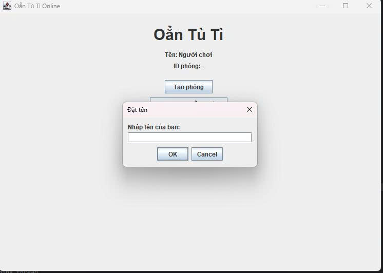
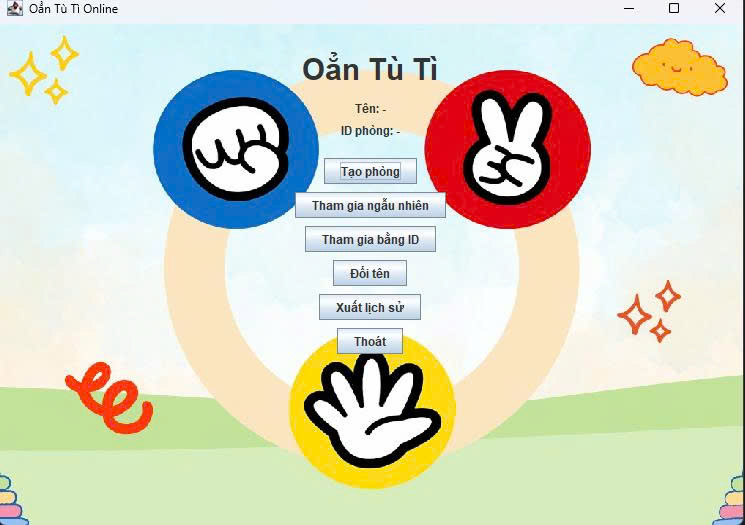
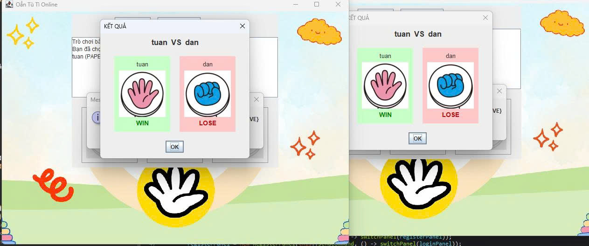
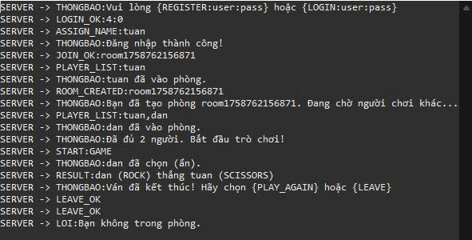

<h2 align="center">
    <a href="https://dainam.edu.vn/vi/khoa-cong-nghe-thong-tin">
    🎓 Faculty of Information Technology (DaiNam University)
    </a>
</h2>
<h2 align="center">
   TRÒ CHƠI OẲN TÙ TÌ QUA MẠNG 
</h2>

    

        
        
        
    

## 📖 **1. Giới thiệu hệ thống**  
Ứng dụng **Game Oẳn Tù Tì (Kéo – Búa – Bao) qua mạng** được xây dựng dựa trên giao thức **TCP**, cho phép hai người chơi thi đấu trực tuyến qua mạng LAN hoặc Internet.  

- **Server**: đóng vai trò trung tâm, quản lý kết nối, phòng chơi và kết quả trận đấu.  
- **Client**: cung cấp giao diện chơi game, cho phép tạo phòng, tham gia phòng và hiển thị kết quả.  
- **Lưu trữ dữ liệu**: có thể mở rộng để lưu lịch sử trận đấu và thống kê thành tích người chơi.  

### ✨ **Tính năng chính**
**Client**  
🎨 **Giao diện:** Java Swing        
🔗 **Kết nối:** Server qua TCP  
🎮 **Phòng chơi:** Tham gia bằng mã hoặc ngẫu nhiên  
⚡ **Gameplay:** Oẳn Tù Tì thời gian thực  
🔄 **Tùy chọn:** Chơi lại hoặc thoát phòng bất kỳ lúc nào  

**Server**  
🔌 **Quản lý kết nối:** hỗ trợ đa luồng, nhiều Client đồng thời  
🎯 **Xử lý logic game:** xác định kết quả dựa trên lựa chọn (Kéo/Búa/Bao)  
👥 **Quản lý người chơi:** tạo, tham gia, rời phòng  
📊 **Lưu trữ (tuỳ chọn):** lịch sử trận đấu ra file  

### 🎲 **Luật Chơi**
✊ **Búa thắng** ✌️ Kéo  
✋ **Bao thắng** ✊ Búa  
✌️ **Kéo thắng** ✋ Bao  
🤝 **Hòa:** khi cả hai chọn giống nhau  

---

## 🔧 **2. Công nghệ sử dụng**  

  
  
  
  
  

  

---

## 🖼️ **3. Một số hình ảnh hệ thống**  
Dưới đây là các hình ảnh minh họa các thành phần và giao diện của hệ thống trò chơi Oẳn Tù Tì qua mạng:

 
  

*<em>Giao diện bắt đầu: Màn hình khởi động của ứng dụng Client, hiển thị các tùy chọn như tạo phòng, tham gia phòng hoặc thoát.</em>*

 
  

*<em>Giao diện chính: Giao diện chính của Client, hiển thị thông tin người chơi, trạng thái kết nối và các nút điều khiển chính.</em>*

 
  

*<em>Giao diện vào phòng: Màn hình cho phép người chơi nhập mã phòng hoặc chọn tham gia phòng ngẫu nhiên.</em>*

 
  

*<em>Giao diện bắt đầu trò chơi: Giao diện hiển thị khi trò chơi bắt đầu, cho phép người chơi chọn Kéo, Búa hoặc Bao và hiển thị thời gian thực.</em>*

 
  

*<em>Giao diện thoát phòng: Màn hình xác nhận khi người chơi muốn rời phòng hoặc thoát trò chơi.</em>*

 
  

*<em>Giao diện log trên Server: Giao diện console hoặc GUI của Server, hiển thị thông tin kết nối, trạng thái phòng, lựa chọn của người chơi và kết quả trận đấu.</em>*

## ⚙️ **4. Các bước cài đặt**  
   

---
## 📬 **5. Liên hệ**
- **Sinh viên thực hiện:** **Nguyễn Trọng Đàn**
- **Khoa Công nghệ Thông tin – Đại học Đại Nam**  
- 🌐 Website: [https://dainam.edu.vn/vi/khoa-cong-nghe-thong-tin](https://dainam.edu.vn/vi/khoa-cong-nghe-thong-tin)  
- 📧 Email: [Shun53137@gmail.com]
- 📱 Fanpage: [AIoTLab - FIT DNU](https://www.facebook.com/DNUAIoTLab)  

