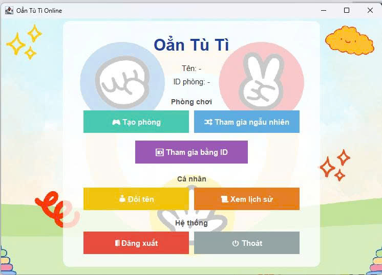
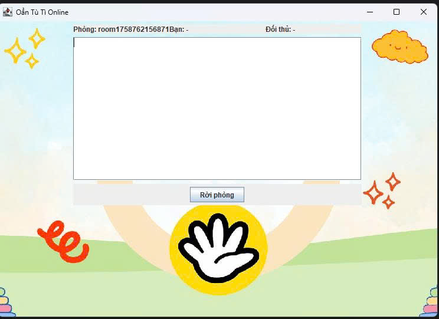

<h2 align="center">
    <a href="https://dainam.edu.vn/vi/khoa-cong-nghe-thong-tin">
    🎓 Faculty of Information Technology (DaiNam University)
    </a>
</h2>
<h2 align="center">
   TRÒ CHƠI OẲN TÙ TÌ QUA MẠNG 
</h2>

    

        
        
        
    

## 📖 **1. Giới thiệu hệ thống**  
Ứng dụng **Game Oẳn Tù Tì (Kéo – Búa – Bao) qua mạng** được xây dựng dựa trên giao thức **TCP**, cho phép hai người chơi thi đấu trực tuyến qua mạng LAN hoặc Internet.  

- **Server**: đóng vai trò trung tâm, quản lý kết nối, phòng chơi và kết quả trận đấu.  
- **Client**: cung cấp giao diện chơi game, cho phép tạo phòng, tham gia phòng và hiển thị kết quả.  
- **Lưu trữ dữ liệu**: có thể mở rộng để lưu lịch sử trận đấu và thống kê thành tích người chơi.  

### ✨ **Tính năng chính**
**Client**  
🎨 **Giao diện:** Java Swing        
🔗 **Kết nối:** Server qua TCP  
🎮 **Phòng chơi:** Tham gia bằng mã hoặc ngẫu nhiên  
⚡ **Gameplay:** Oẳn Tù Tì thời gian thực  
🔄 **Tùy chọn:** Chơi lại hoặc thoát phòng bất kỳ lúc nào  

**Server**  
🔌 **Quản lý kết nối:** hỗ trợ đa luồng, nhiều Client đồng thời  
🎯 **Xử lý logic game:** xác định kết quả dựa trên lựa chọn (Kéo/Búa/Bao)  
👥 **Quản lý người chơi:** tạo, tham gia, rời phòng  
📊 **Lưu trữ (tuỳ chọn):** lịch sử trận đấu ra file  

### 🎲 **Luật Chơi**
✊ **Búa thắng** ✌️ Kéo  
✋ **Bao thắng** ✊ Búa  
✌️ **Kéo thắng** ✋ Bao  
🤝 **Hòa:** khi cả hai chọn giống nhau  

---

## 🔧 **2. Công nghệ sử dụng**  

  
  
  
  
  

  

---

## 🖼️ **3. Một số hình ảnh hệ thống**  
Dưới đây là các hình ảnh minh họa các thành phần và giao diện của hệ thống trò chơi Oẳn Tù Tì qua mạng:

  
   
  <em>Giao diện bắt đầu: Màn hình khởi động của ứng dụng Client, hiển thị các tùy chọn như tạo phòng, tham gia phòng hoặc thoát.</em>

  
   
  <em>Giao diện chính: Giao diện chính của Client, hiển thị thông tin người chơi, trạng thái kết nối và các nút điều khiển chính.</em>

  
   
  <em>Giao diện vào phòng: Màn hình cho phép người chơi nhập mã phòng hoặc chọn tham gia phòng ngẫu nhiên.</em>

  
   
  <em>Giao diện bắt đầu trò chơi: Giao diện hiển thị khi trò chơi bắt đầu, cho phép người chơi chọn Kéo, Búa hoặc Bao và hiển thị thời gian thực.</em>

  
   
  <em>Giao diện thoát phòng: Màn hình xác nhận khi người chơi muốn rời phòng hoặc thoát trò chơi.</em>

  
   
  <em>Giao diện log trên Server: Giao diện console hoặc GUI của Server, hiển thị thông tin kết nối, trạng thái phòng, lựa chọn của người chơi và kết quả trận đấu.</em>

---

## ⚙️ **4. Các bước cài đặt**     

🛠️ 4.1. Yêu cầu hệ thống    

☕ Java Development Kit (JDK): Phiên bản 8+ (khuyến nghị JDK 11 hoặc 17)     

💻 Hệ điều hành: Windows, macOS, hoặc Linux    

🖥️ Môi trường phát triển: IDE (IntelliJ IDEA, Eclipse, NetBeans) hoặc terminal   

📡 Kết nối mạng: LAN hoặc Internet nếu muốn nhiều máy chơi cùng nhau   

💾 Bộ nhớ: ≥ 4GB RAM, dung lượng trống tối thiểu 500MB   

📥 4.2. Các bước cài đặt     
🧰 Bước 1: Chuẩn bị môi trường     

- Cài đặt Java    

- Yêu cầu JDK 8 trở lên (JDK 21 vẫn chạy tốt).    

- Kiểm tra bằng lệnh:       

      java -version   
      javac -version  

- Nếu cả hai hiển thị version ≥ 8 là hợp lệ.  

- Cấu trúc thư mục dự án:      

    └── src/             
      ├── client/     # Code giao diện & xử lý phía Client              
      ├── server/     # Code xử lý Server & quản lý phòng chơi       

🏗 Bước 2: Biên dịch mã nguồn   

- Mở terminal và điều hướng đến thư mục dự án:   

      cd D:\Download\LTM-1604-D09-OTT-TCP\src   

▶️ Bước 3: Chạy ứng dụng    

- Khởi động Server   
- java server.GameServer   
- Server sẽ chạy trên port mặc định 12345 (có thể chỉnh trong code).   
- Console hiển thị:   
- GameServer running on port 12345     
- Khởi động Client     
- java client.GameClient     
- Mỗi client mở 1 terminal hoặc chạy nhiều lần từ IDE.     
- Khi vào, nhập Tên người chơi + IP Server + Port.     
- Ví dụ: nhập 127.0.0.1 nếu client và server chạy cùng máy.    
🚀 Cách Chơi     
- nhập tên người chơi khi mở Client.      
- Tạo phòng / Tham gia phòng: chọn ngẫu nhiên hoặc nhập ID phòng.      
- Gameplay:      
    ✊ Búa thắng ✌️ Kéo       
    ✋ Bao thắng ✊ Búa      
    ✌️ Kéo thắng ✋ Bao       
- Kết quả: hiển thị ngay sau khi cả 2 chọn xong.      
- Sau trận:      
- Chọn Play Again để chơi tiếp.     
- Chọn Leave để thoát phòng.      

---
## 📬 **5. Liên hệ**
- **Sinh viên thực hiện:** **Nguyễn Trọng Đàn**
- **Khoa công nghệ thông tin – Đại học Đại Nam**  
- 🌐 Website: [https://dainam.edu.vn/vi/khoa-cong-nghe-thong-tin](https://dainam.edu.vn/vi/khoa-cong-nghe-thong-tin)  
- 📧 Email: [Shun53137@gmail.com]
- 📱 Fanpage: [AIoTLab - FIT DNU](https://www.facebook.com/DNUAIoTLab)  

